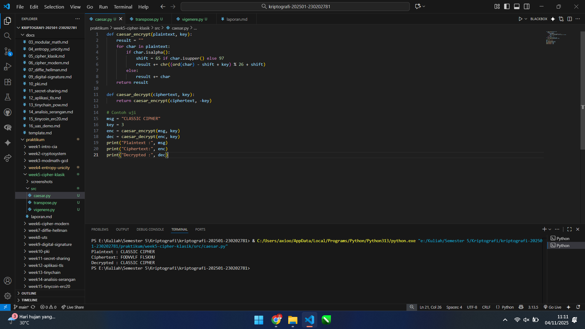
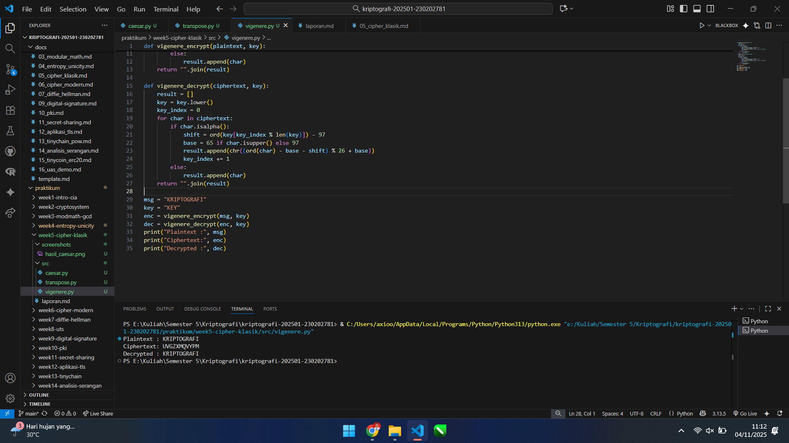
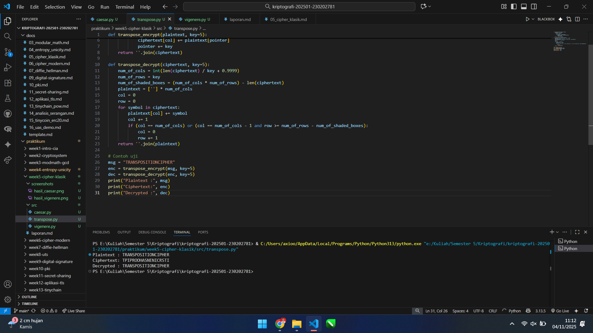

# Laporan Praktikum Kriptografi
Minggu ke-: 5  
Topik: Cipher Klasik (Caesar, Vigenère, Transposisi)   
Nama: Reza Dwi Nugroho  
NIM: 230202781  
Kelas: 5 IKRB   

---

## 1. Tujuan
1. Menerapkan algoritma Caesar Cipher untuk enkripsi dan dekripsi teks.  
2. Menerapkan algoritma Vigenere Cipher dengan variasi kunci.  
3. Mengimplementasikan algoritma transposisi sederhana.  
4. Menjelaskan kelemahan algoritma kriptografi klasik.  

---

## 2. Dasar Teori
Kriptografi klasik merujuk pada metode enkripsi yang digunakan sebelum era komputasi modern, umumnya diimplementasikan secara manual (dengan tangan) atau dengan perangkat mekanis sederhana. Algoritma ini terbagi menjadi dua kategori utama: cipher substitusi (substitution) dan cipher transposisi (transposition). Kedua metode ini mengandalkan kerahasiaan algoritma (security by obscurity), yang kini dianggap tidak aman.  
Cipher substitusi menggantikan unit plaintext (satu huruf atau grup huruf) dengan unit ciphertext lain. Contoh paling sederhana adalah Caesar Cipher, sebuah cipher substitusi monoalfabetik yang menggeser setiap huruf dalam alfabet dengan jumlah tetap (kunci). Vigenère Cipher adalah pengembangan dari Caesar Cipher, menggunakan substitusi polialfabetik dengan serangkaian kunci (berupa kata) untuk mengatasi kelemahan analisis frekuensi. Aritmetika modular (operasi modulo 26) adalah inti dari perhitungan pergeseran huruf dalam cipher-cipher ini.  
Cipher transposisi, di sisi lain, tidak mengubah huruf-huruf plaintext itu sendiri, tetapi hanya mengatur ulang (mengacak) urutannya. Plaintext ditulis dalam sebuah grid (matriks) berdasarkan lebar kunci, dan ciphertext dibaca kolom per kolom dalam urutan yang berbeda. Meskipun metode ini dapat menyamarkan pesan, ia mempertahankan frekuensi statistik huruf dari plaintext aslinya, yang menjadi salah satu kelemahannya.  

---

## 3. Alat dan Bahan
- Python 3.13  
- Visual Studio Code  
- Git dan akun GitHub

---

## 4. Langkah Percobaan
1. Membuat file `caesar_cipher.py` di folder `praktikum/week5-cipher-klasik/src/`.  
2. Menyalin kode program dari panduan praktikum.  
3. Menjalankan program dengan perintah `python caesar_cipher.py`.  
4. Membuat struktur direktori `praktikum/week5-cipher-klasik/` yang berisi folder `src/`, `screenshots/`, dan file `laporan.md`.  
5. Membuat file `src/caesar.py` dan mengimplementasikan kode program Caesar Cipher sesuai panduan.  
6. Membuat file `src/vigenere.py` dan mengimplementasikan kode program Vigenère Cipher sesuai panduan.  
7. Membuat file `src/transpose.py` dan mengimplementasikan kode program Transposisi Sederhana sesuai panduan.  
8. Menjalankan ketiga file program satu per satu menggunakan terminal untuk memverifikasi proses enkripsi dan dekripsi.  
9. Mengambil screenshot dari output terminal yang menunjukkan hasil eksekusi program dan menyimpannya di folder `screenshots/`.  
10. Menyusun laporan ini (`laporan.md`) dan menjawab pertanyaan diskusi.  
11. Melakukan commit dan push ke repositori Git dengan pesan commit `week5-cipher-klasik`.  

---

## 5. Source Code
```python
#Caesar Cipher
def caesar_encrypt(plaintext, key):
    result = ""
    for char in plaintext:
        if char.isalpha():
            shift = 65 if char.isupper() else 97
            result += chr((ord(char) - shift + key) % 26 + shift)
        else:
            result += char
    return result

def caesar_decrypt(ciphertext, key):
    return caesar_encrypt(ciphertext, -key)

msg = "CLASSIC CIPHER"
key = 3
enc = caesar_encrypt(msg, key)
dec = caesar_decrypt(enc, key)
print("Plaintext :", msg)
print("Ciphertext:", enc)
print("Decrypted :", dec)


#Implementasi Vigenère Cipher
def vigenere_encrypt(plaintext, key):
    result = []
    key = key.lower()
    key_index = 0
    for char in plaintext:
        if char.isalpha():
            shift = ord(key[key_index % len(key)]) - 97
            base = 65 if char.isupper() else 97
            result.append(chr((ord(char) - base + shift) % 26 + base))
            key_index += 1
        else:
            result.append(char)
    return "".join(result)

def vigenere_decrypt(ciphertext, key):
    result = []
    key = key.lower()
    key_index = 0
    for char in ciphertext:
        if char.isalpha():
            shift = ord(key[key_index % len(key)]) - 97
            base = 65 if char.isupper() else 97
            result.append(chr((ord(char) - base - shift) % 26 + base))
            key_index += 1
        else:
            result.append(char)
    return "".join(result)

msg = "KRIPTOGRAFI"
key = "KEY"
enc = vigenere_encrypt(msg, key)
dec = vigenere_decrypt(enc, key)
print("Plaintext :", msg)
print("Ciphertext:", enc)
print("Decrypted :", dec)


#Implementasi Transposisi Sederhana
def transpose_encrypt(plaintext, key=5):
    ciphertext = [''] * key
    for col in range(key):
        pointer = col
        while pointer < len(plaintext):
            ciphertext[col] += plaintext[pointer]
            pointer += key
    return ''.join(ciphertext)

def transpose_decrypt(ciphertext, key=5):
    num_of_cols = int(len(ciphertext) / key + 0.9999)
    num_of_rows = key
    num_of_shaded_boxes = (num_of_cols * num_of_rows) - len(ciphertext)
    plaintext = [''] * num_of_cols
    col = 0
    row = 0
    for symbol in ciphertext:
        plaintext[col] += symbol
        col += 1
        if (col == num_of_cols) or (col == num_of_cols - 1 and row >= num_of_rows - num_of_shaded_boxes):
            col = 0
            row += 1
    return ''.join(plaintext)

msg = "TRANSPOSITIONCIPHER"
enc = transpose_encrypt(msg, key=5)
dec = transpose_decrypt(enc, key=5)
print("Plaintext :", msg)
print("Ciphertext:", enc)
print("Decrypted :", dec)
```
---

## 6. Hasil dan Pembahasan
Hasil eksekusi program:



---

## 7. Jawaban Pertanyaan
1. **Kelemahan Utama Caesar Cipher dan Vigenère Cipher**  
Caesar Cipher Kelemahan paling fatal dari Caesar Cipher adalah ruang kunci (key space) yang sangat kecil.  
- Hanya 25 Kunci: Dalam alfabet Latin (26 huruf), hanya ada 25 kemungkinan pergeseran yang (pergeseran 0 tidak dihitung karena tidak mengubah teks).  
- Serangan Brute-Force: Karena jumlah kuncinya sangat sedikit, penyerang dapat dengan mudah mencoba setiap kemungkinan pergeseran (dari 1 hingga 25) pada ciphertext. Metode ini dikenal sebagai serangan brute-force. Dalam hitungan detik, salah satu dari 25 percobaan itu pasti akan menghasilkan plaintext yang dapat dibaca.  
- Analisis Frekuensi: Sandi ini sama sekali tidak menyembunyikan pola frekuensi bahasa. Jika 'E' adalah huruf paling umum dalam plaintext, maka huruf 'H' (jika kuncinya 3) akan menjadi huruf paling umum dalam ciphertext.  
  
Vigenère Cipher Vigenère jauh lebih kuat dari Caesar karena merupakan sandi poli-alfabetik (satu huruf plaintext bisa menjadi beberapa huruf ciphertext yang berbeda). Namun, kelemahan utamanya adalah sifat kunci yang berulang (repeating key).  
- Pola yang Berulang: Jika kunci yang digunakan adalah "KUNCI" (panjang 5), maka setiap huruf ke-5 dalam teks akan dienkripsi menggunakan "pergeseran Caesar" yang sama. Huruf ke-1, ke-6, ke-11, dst., semuanya dienkripsi dengan huruf 'K'. Huruf ke-2, ke-7, ke-12, dst., semuanya dienkripsi dengan 'U'.  
- Analisis Kasiski: Kelemahan ini dapat dieksploitasi untuk menemukan panjang kunci. Penyerang mencari urutan huruf yang berulang dalam ciphertext (misalnya "NQR"). Jarak antara kemunculan "NQR" ini kemungkinan besar adalah kelipatan dari panjang kunci.  
- Indeks Koinsidensi (IC): Metode statistik ini juga dapat digunakan untuk menebak panjang kunci dengan sangat akurat.  
- Memecah Sandi: Setelah panjang kunci (misalnya, 5) diketahui, penyerang dapat memisahkan ciphertext menjadi 5 bagian. Setiap bagian pada dasarnya adalah Caesar Cipher sederhana yang dapat dipecahkan secara individual menggunakan analisis frekuensi.  
2. **Mengapa Cipher Klasik Mudah Diserang Analisis Frekuensi**  
Sandi klasik (terutama sandi substitusi mono-alfabetik seperti Caesar Cipher atau Simple Substitution Cipher) sangat rentan terhadap analisis frekuensi karena mereka mempertahankan pola statistik bahasa asli.  
Setiap bahasa memiliki "sidik jari" statistik. Misalnya, dalam bahasa Inggris, huruf 'E' muncul sekitar 12.7% dari waktu, diikuti oleh 'T' (9.1%), 'A' (8.2%), dan seterusnya.
Ketika menggunakan sandi substitusi mono-alfabetik, membuat pemetaan satu-ke-satu (1:1) yang tetap:  
- Setiap 'E' dalam plaintext selalu menjadi (misalnya) 'K' dalam ciphertext.  
- Setiap 'T' dalam plaintext selalu menjadi (misalnya) 'G' dalam ciphertext.  
Akibatnya, "sidik jari" statistik dari plaintext tidak hancur, tetapi hanya "disamarkan" atau "digeser".  
Jika seorang penyerang menganalisis ciphertext dan menemukan bahwa huruf 'K' adalah yang paling sering muncul (sekitar 12.7%), mereka dapat dengan sangat yakin menebak bahwa 'K' adalah pengganti untuk 'E'. Dengan mengidentifikasi beberapa huruf yang paling sering muncul, penyerang dapat merekonstruksi sebagian besar kunci dan memecahkan sandi tersebut.  
Sandi Vigenère dirancang untuk mengalahkan analisis frekuensi sederhana ini dengan memiliki pemetaan banyak-ke-satu (poli-alfabetik), di mana 'E' bisa menjadi 'K' di satu tempat dan 'S' di tempat lain. Namun, seperti yang dijelaskan di poin 1, kelemahan kunci yang berulang membuatnya tetap rentan.  
3. **Perbandingan Cipher Substitusi vs Transposisi**  
Perbandingan antara sandi substitusi dan transposisi menyoroti dua teknik dasar kriptografi. Substitusi bekerja dengan mengganti setiap huruf plaintext dengan huruf atau simbol lain, seperti pada Caesar Cipher. Tujuannya adalah untuk mencapai Confusion (kebingungan), yaitu membuat hubungan antara plaintext dan ciphertext menjadi sekompleks mungkin. Kelemahannya adalah kerentanannya terhadap analisis frekuensi.  
Sebaliknya, sandi transposisi bekerja dengan mengacak urutan huruf plaintext tanpa mengubah huruf itu sendiri. Tujuannya adalah untuk mencapai Diffusion (penyebaran), yaitu menyebarkan pengaruh satu huruf plaintext ke banyak bagian ciphertext. Kelebihannya adalah ia secara inheren mengalahkan analisis frekuensi huruf tunggal (karena frekuensi huruf di ciphertext sama persis dengan di plaintext). Namun, kelemahannya adalah ia rentan terhadap anagramming (penyusunan ulang) dan analisis frekuensi lanjutan pada pola pasangan huruf (digram).  
---

## 8. Kesimpulan  
Praktikum ini telah berhasil mengimplementasikan algoritma Caesar Cipher, Vigenère Cipher, dan Transposisi Sederhana menggunakan Python, di mana proses enkripsi dan dekripsi dapat divalidasi dengan benar. Melalui implementasi dan analisis, dapat dipahami bahwa meskipun Vigenère menawarkan peningkatan keamanan atas Caesar dengan substitusi polialfabetik, semua cipher klasik ini memiliki kelemahan fundamental—seperti ruang kunci yang kecil, pola kunci yang berulang, atau kegagalan menyembunyikan frekuensi statistik—yang membuatnya rentan terhadap serangan dan tidak aman untuk standar modern.  

---

## 9. Daftar Pustaka


---

## 10. Commit Log  
commit 4962a7738b4f24a02766ce271ca145d71e7174b9  
Author: Reza Dwi Nugroho <rejadwi016@gmail.com>  
Date:   2025-11-18  
```
